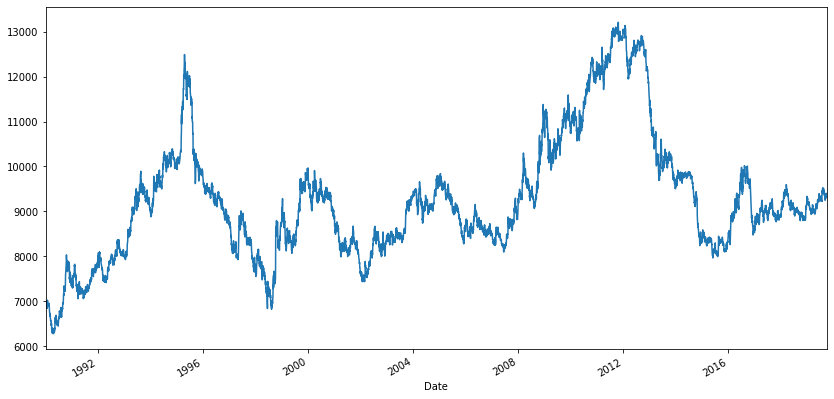
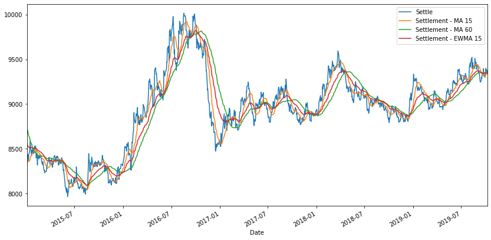
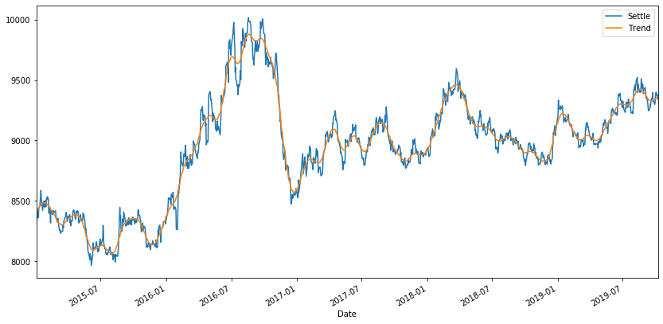
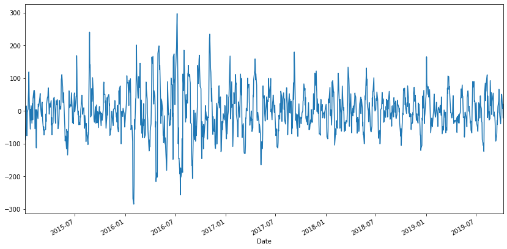
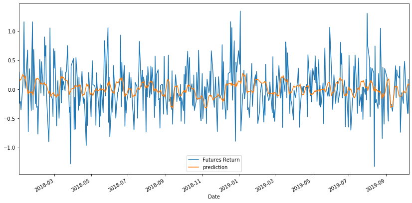
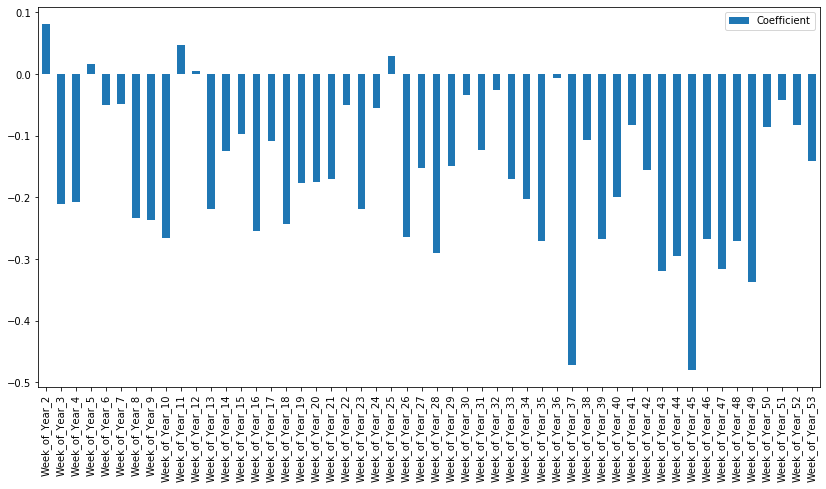
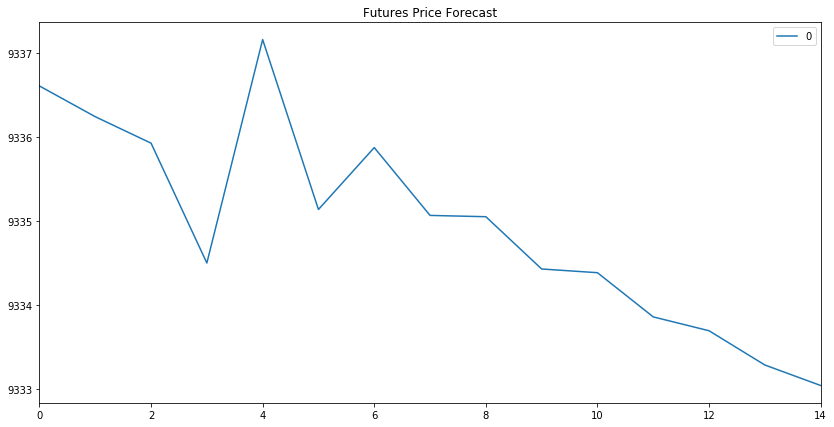
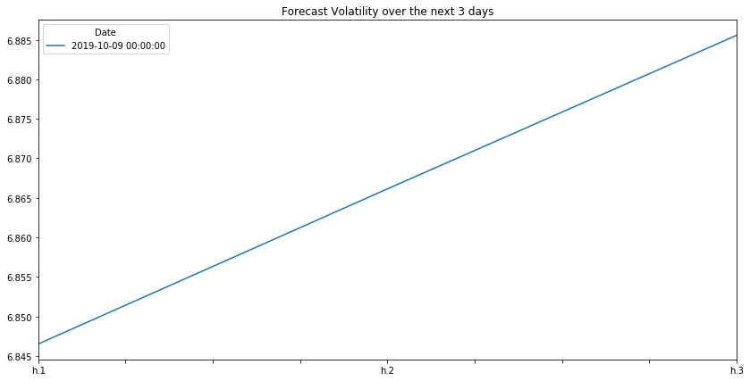

# Unit 10 Homework: Time Series Analysis - Findings Report

## Time-Series Return Forecasting Summary:

To begin, since before 1992, the settle price for the Japanese Yen has been positive long term. When broken into short term intervals, it has been rather volatile.

When graphing it with moving averages, the long-term positive movement becomes much more apparent.

Similar conclusions are revealed when plotting after filtering out the noise.

While inspecting the R-2 and root-mean-squared-error when trying to find seasonality, it is realized that the model used to determine that is not very good. With that caveat, the predictions did have very similar movement to the futures return. 

It also appeared to have detected seasonality in weeks 43-49.

Lastly, according to another model, it appears the Yen will experience a downward trend in it’s futures forecast.

## Volatility Forecasting Summary:

When modelling for volatility, there appears to be clustering of volatility. It, however, cannot be fully attributed to seasonality.

As for forecasting volatility in the near future, the Yen is predicted to have it’s variance increase in the three days.

